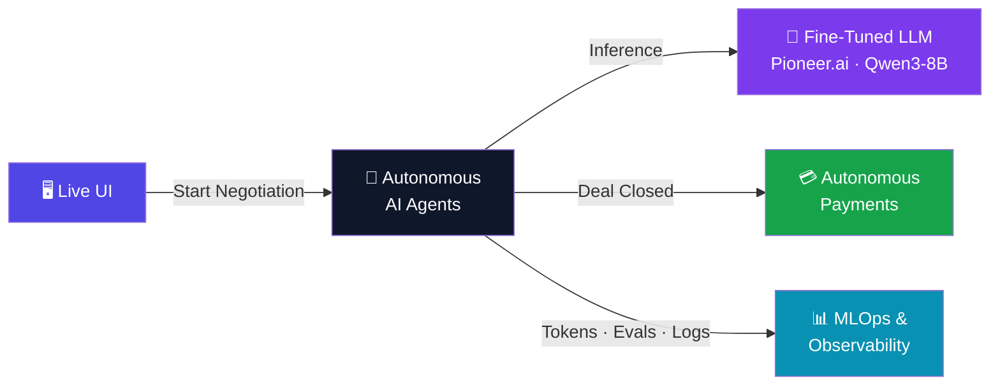

> **Portfolio note:** this repository preserves the original team's full commit history.
> For what I personally contributed here, see [PORTFOLIO.md](PORTFOLIO.md).
> Architecture walkthrough: [docs/SYSTEM-DEEPDIVE.md](docs/SYSTEM-DEEPDIVE.md)

# Agentic Negotiation & Procurement Platform

> Autonomous AI agents that negotiate deals and settle payments — no humans required.

Two LLM-powered agents (Vendor and Buyer) negotiate a purchase deal inside a LangGraph state machine, driven by a fine-tuned **Qwen3-8B** model on **Pioneer.ai**. When both sides agree, a Stripe-shaped payment flow fires automatically and an invoice is generated — end to end, no human in the loop.

---

## How it works

When you hit **Start Negotiation**, the backend spins up a LangGraph session. The Vendor and Buyer agents take turns proposing prices. Every message must end with a structured tag:

```
[OFFER price=X.XX quantity=N action=ACCEPT|COUNTER|REJECT]
```

A guardrail node validates each offer against each side's hard constraints. Once both agents emit `ACCEPT` at an agreed price, the graph automatically transitions to the payment flow — the Vendor creates a Stripe `PaymentIntent`, the Buyer confirms it, and an invoice is produced. The UI streams every step live.

---

## Screenshot


---

## Architecture



---

## Repo layout

```
Backend/
  app/
    main.py         API endpoints (health, config, negotiations)
    graph.py        LangGraph state machine + all agent/payment nodes
    llm_client.py   Pioneer.ai client — falls back to mock if unconfigured
    payments.py     Mock Stripe PaymentIntent lifecycle
    telemetry.py    ClickHouse client (lazy-init, non-blocking)
    config.py       Vendor/Buyer domain config
  tests/            pytest suite (50 tests)

UI/
  src/
    api.js               fetchConfig / startNegotiation / fetchNegotiation
    useConfig.js         Config hook (fetches GET /config once on mount)
    useNegotiation.js    Polling hook (polls every ~1s until terminal state)
    InventoryContext.jsx  Vendor/Buyer cards + deal-zone price bar
    MessageLog.jsx        Live negotiation transcript
    InvoiceBlock.jsx      Final invoice display
    mock.js              Local mock (VITE_USE_MOCK=true)

eval/
  pioneer_mlops.py  Generates synthetic training data + fine-tunes Qwen3-8B

docs/screenshots/   App screenshots (replace placeholders with real images)
render.yaml         Render deployment config
startup.sh          One-command local dev launcher
```

---

## Quick start

### Prerequisites

- Python 3.12+
- Node.js 18+
- A Pioneer.ai API key — without it the backend falls back to a deterministic mock (still fully functional for UI development)

### 1. Configure environment

```bash
cp .env.example .env
# Fill in PIONEER_API_KEY (required for live LLM negotiation)
# ClickHouse credentials are optional — telemetry is disabled if unset
```

```bash
cp UI/.env.example UI/.env
# Only needed if pointing at a deployed backend (VITE_API_BASE)
```

### 2a. One-command startup (recommended)

```bash
./startup.sh
```

Starts the FastAPI backend on `:8000` and Vite on `:5173`. Open `http://localhost:5173` and click **Start Negotiation**. Stop both with `Ctrl+C`.

### 2b. Manual startup

**Backend:**
```bash
cd Backend
python -m venv .venv
source .venv/bin/activate      # Windows: .venv\Scripts\activate
pip install -r requirements.txt
uvicorn app.main:app --reload --port 8000
```

**UI:**
```bash
cd UI
npm install
npm run dev
# Open http://localhost:5173
```

The Vite dev proxy forwards `/negotiations/*` and `/config` to `:8000` — no CORS setup needed locally.

### Mock mode (no backend required)

```bash
cd UI
VITE_USE_MOCK=true npm run dev
```

Replays a scripted 6-turn negotiation with shapes that mirror the real backend exactly.

---

## Environment variables

### Backend (`.env`)

| Variable | Required | Description |
|---|---|---|
| `PIONEER_API_KEY` | For live LLM | Pioneer.ai API key. Without it, agents use a deterministic mock. |
| `PIONEER_MODEL` | No | Model ID or training job ID. Defaults to `gpt-4.1-mini`. Production uses the fine-tuned Qwen3-8B adapter. |
| `CLICKHOUSE_HOST` | No | ClickHouse host. Leave blank to disable telemetry. |
| `CLICKHOUSE_PORT` | No | Defaults to `8443`. |
| `CLICKHOUSE_DATABASE` | No | Defaults to `default`. |
| `CLICKHOUSE_USER` | No | ClickHouse username. |
| `CLICKHOUSE_PASSWORD` | No | ClickHouse password. |
| `CLICKHOUSE_SECURE` | No | Defaults to `true`. |

### UI (`UI/.env`)

| Variable | Required | Description |
|---|---|---|
| `VITE_API_BASE` | Production only | Backend URL e.g. `https://negotiate-backend.onrender.com`. Leave blank locally (Vite proxy handles it). |
| `VITE_USE_MOCK` | No | Set to `true` to run without a backend. |

---

## API reference

| Method | Path | Description |
|---|---|---|
| `GET` | `/health` | Health check → `{"status": "ok"}` |
| `GET` | `/config` | Vendor + buyer domain config (prices, product, quantities) |
| `POST` | `/negotiations/start` | Start a negotiation → `{"transaction_id": "<uuid>"}` |
| `GET` | `/negotiations/{id}` | Poll state → status, messages, invoice |

---

## Tests

```bash
cd Backend
source .venv/bin/activate
pytest
# 50 tests, all passing
```

---

## Deployment (Render)

`render.yaml` configures the backend service. The critical setting is binding uvicorn to `0.0.0.0` so Render's port scanner can detect it:

```
startCommand: uvicorn app.main:app --host 0.0.0.0 --port $PORT
```

Set all backend env vars in Render's **Environment** tab. The `.env` file is gitignored and never deployed.

---

## Fine-tuned model

`eval/pioneer_mlops.py` generates a synthetic negotiation dataset and fine-tunes `Qwen/Qwen3-8B` (LoRA) via Pioneer's training API. The deployed adapter (`negotiation-agent-evals-20260612211958`) is what both agents use in production — ~120 tokens per turn, structurally reliable output compared to prompting a general-purpose model. See `PIONEER_SETUP.md` for the full integration notes and live verification log.

---

## Stack

Python · FastAPI · LangGraph · LangChain · Pioneer.ai · Qwen3-8B · React · Vite · ClickHouse · Stripe · Render
